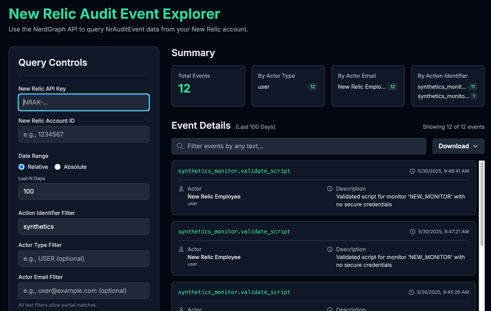

# New Relic Audit Event Explorer

## Purpose

This tool allows you to efficiently explore `NrAuditEvent` data from your New Relic account to see what entities are being changed, when those changes occurred, and by whom.




---

## How to Set Up and Run

This application uses a Python Flask backend to securely handle API requests and an HTML/JavaScript frontend for the user interface.

### Prerequisites

- Python 3.6+
- `pip` (Python package installer)

### Server Setup

1.  **Create a Virtual Environment:**
    Open a terminal or command prompt in the project directory and create a virtual environment. This isolates the project's dependencies.
    ```bash
    python -m venv venv
    ```

2.  **Activate the Virtual Environment:**
    -   **On macOS/Linux:**
        ```bash
        source venv/bin/activate
        ```
    -   **On Windows:**
        ```bash
        .\venv\Scripts\activate
        ```
    You'll know it's active when you see `(venv)` at the beginning of your command prompt.

3.  **Install Dependencies:**
    Install the required Python libraries using the provided `requirements.txt` file.
    ```bash
    pip install -r requirements.txt
    ```

### Running the Application

1.  **Start the Server:**
    With your virtual environment still active, run the Flask server.
    ```bash
    python server.py
    ```
    The server will start and listen for requests on `http://127.0.0.1:5001`.

2.  **Access the UI:**
    Open any modern web browser and navigate to the following address:
    ```
    http://127.0.0.1:5001
    ```
    The server will automatically load the user interface.

---

## How to Use

### 1. Enter Credentials

You must provide two pieces of information to connect to your New Relic account:
-   **New Relic API Key:** Your User API key. This is treated as a password and is required for every request.
-   **New Relic Account ID:** The numerical ID of the account you wish to query.

### 2. Apply Filters

You can narrow down your search using a combination of the following filters:

-   **Date Range:**
    -   **Relative:** A simple way to look at the last "N" days.
    -   **Absolute:** Use the calendar and time picker to select a precise start and end date/time.
-   **Action Identifier Filter:** A text field to find specific actions (e.g., `dashboard.create`, `alert`). Partial matches are supported.
-   **Actor Type Filter:** A text field to filter by the type of actor (e.g., `USER`, `API_KEY`). Partial matches are supported.
-   **Actor Email Filter:** A text field to find events initiated by a specific user email. Partial matches are supported.

### 3. Explore Results

After running a query, the results are displayed in several ways:
-   **Summary View:** High-level counts of total events, broken down by actor type, email, and action identifier.
-   **Event Details:** A scrollable list of individual event cards, each showing the most relevant information.
-   **Live Filter:** A search bar above the event details that lets you instantly filter the visible results by any text.
-   **Entity Details:** If an event is associated with a specific New Relic entity, an "Entity Details..." button will appear. Clicking it opens a pop-up with detailed information about that entity.

### 4. Download Data

To the right of the live filter bar is a **Download** button. This allows you to download the currently filtered list of events in two formats:
-   **JSON:** A structured file containing all event data.
-   **CSV:** A spreadsheet-friendly format for use in other tools.
